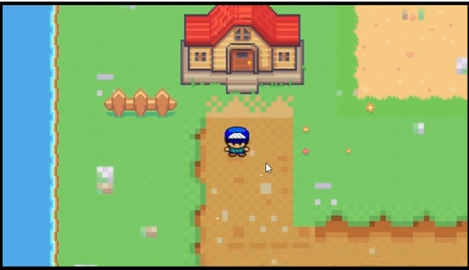
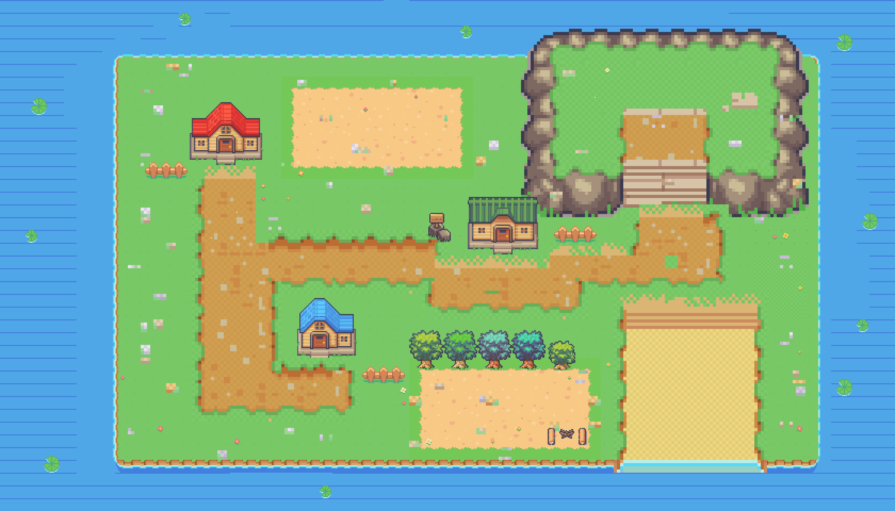

# 1st-pokemon-game

#### Video Demo:  <https://youtu.be/tvwTLzRrv3A>
#### Description:

Main task:
Pokemon style RPG game include battle field, audio, pokemon, avatar

prerequisite: map, battle filed background img, main avatar img set (includes 4 directions), 2 pokemon img set, attacks animate img set, audio files

progrgram language: javascript, CSS, html

1. build a World map via Tiled
  use png img dataset drawing the island which your main avatar will travel
  
2. reference the map at html
3. 
